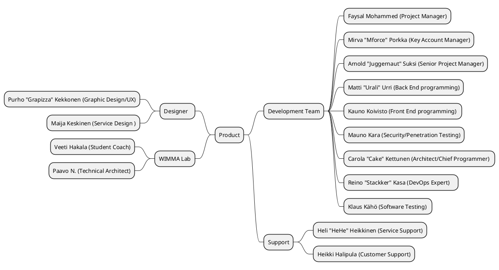
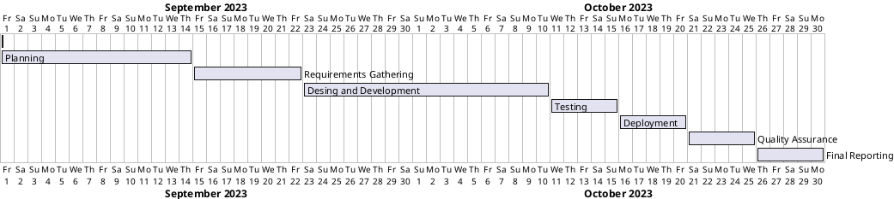

0# Short Project Plan

|  |  |
|:-:|:-:|
| Document | Short Project Plan |
| Author: | Faysal Mohammed |
| Version: | 0.1 |
| Date: | 01.09.2023 |

## 1. Assignment

## 1.1 background and starting points

CodeMinds Ltd has been tasked with fulfilling an order from a fresh client, the educational project platform WIMMA Lab. These customers are broadening their reach to a wider audience, adjusting their education platforms to better suit remote work and online learning. In line with CodeMinds' company mission, they are working on creating a forum service for WIMMA Lab to seamlessly integrate into their website.

This task encompasses the obstacles and possibilities that CodeMinds encounters in a competitive industry. Priorities include providing economical solutions, upholding rigorous information security standards, and meeting demanding performance criteria. In the upcoming sections, we'll explore the intricacies of this project, covering its phases, key stakeholders, objectives, and resource distribution, along with other vital particulars.

In a wider perspective, this project aligns with the TTOS2070 Guideline Institute of Jyväskylä University of Applied Sciences, embodying an inventive initiative that employs contemporary approaches in software development and project management. CodeMinds, as a company, is devoted to delivering solutions tailored to customer requirements, and this project exemplifies our commitment to addressing the distinct needs of our clients.

## 1.2 Goals and tasks

### 1.2.1 What action is to be developed and how?
First things first, let's break down the key actions and how to approach them:

### Project Phases:
* Identify and define clear project phases, such as planning, development, testing, and deployment.
* Develop a detailed project timeline to ensure a structured and organized workflow.

#### Phase 1: Preliminary planning [GATE 2 (approx. 2 weeks)]
* Begin the project by assembling the project team and delineating roles and responsibilities.
* Recognize all crucial stakeholders, whether internal or external, to guarantee efficient communication and collaboration.
* Hold a project initiation meeting to ensure that everyone is in sync with the project's goals and extent.
#### Phase 2: Start and planning [GATE 1 (approx. 1 week)]
* Create an all-encompassing project blueprint that details the project's extent, timetable, financial plan, and distribution of resources.
* Work together with representatives from WIMMA Lab to collect comprehensive requirements for the Forum service.
* Evaluate the resources required for each stage of the project, encompassing personnel, technology, and time.
#### Phase 3: Implementation begins [GATE 2]
* Commence the design and development phase of the Forum service, encompassing back-end and front-end programming, graphic design, and user experience design.
* Incorporate continuous integration practices to guarantee the quality and reliability of the code.
* Conduct thorough testing, encompassing both functional and performance testing, to ensure the service aligns with the client's specifications.
#### Phase 4:  Checks and repairs [GATE 3 (approx. 2 weeks)]
* Ensure that the products or services meet specified standards and requirements. It is a systematic approach that aims to prevent defects, errors, and issues in the project development.
* Incorporating client feedback into the quality improvement process to align products or services with client expectations.
* Regularly monitoring and evaluating processes and outputs to identify deviations from quality standards and take corrective actions.
#### Phase 5: Delivery and project termination [GATE 4 (approx. 1 week)]
* Checking for vulnerabilities and ensuring that security measures are effective.
* Ensuring that all components and modules of the system work together seamlessly.
* Assessing the system's user-friendliness and overall user experience.
* Develop a deployment plan that outlines the steps, timelines, and resources required for a smooth transition to the live environment.
* Ensure that all configurations, settings, and parameters are appropriately adjusted for the production environment.
* Transfer and verify data from the testing or development environment to the production environment, ensuring data integrity.
* Update documentation, including user manuals and system documentation, to reflect any changes introduced during deployment.
* Ensures that end-users can access and benefit from the finalized product or system.
#### Phase 6: In service production [GATE 5 (approx. 2 days)]
* CodeMinds support team Assisting users with technical issues, troubleshooting problems, and providing solutions to ensure the smooth functioning of software, hardware, or systems.
* Addressing inquiries, concerns, and feedback from customers, providing information, and ensuring a positive customer experience.
* Creating and maintaining documentation, FAQs, and knowledge base articles to empower users to find solutions independently.
* Gathering feedback from users to understand their needs, identify areas for improvement, and enhance the overall user experience.
### Key Stakeholders:
* Identify all key stakeholders, both internal and external, to ensure effective communication and collaboration.
* Establish regular communication channels, like meetings or updates, to keep everyone in the loop.

**WIMMA Lab's Student Coach (Veeti Hakala)**: The client's representative and primary contact person for project requirements and feedback.

**WIMMA Lab's Technical Architect (Paavo N)**: Provides technical insights and guidance.

**Student Representatives**: Represent the end-users and provide feedback on usability.

**CodeMinds Project Team**: Comprises project management, development, testing, and design teams responsible for the project's execution.

### Objectives:
* Clearly define the objectives of the forum service development. What specific features and functionalities are crucial for WIMMA Lab?
* Prioritize objectives based on WIMMA Lab's requirements and CodeMinds' capabilities.

### Resource Allocation:
* Assess the resources needed for each phase of the project, including manpower, technology, and time.
* Allocate resources efficiently to ensure a balance between quality and timeliness.

### Challenges and Opportunities:
* Conduct a thorough analysis of potential challenges and opportunities in the industry.
* Develop strategies to mitigate challenges and capitalize on opportunities, staying ahead of the competition.

### Cost-Effective Solutions:
* Explore cost-effective technologies and methodologies without compromising quality.
* Regularly evaluate the budget against the project progress and make adjustments if necessary.

### Information Security Standards:
* Implement robust security measures throughout the development process.
* Regularly update and audit security protocols to stay ahead of potential threats.

### Performance Criteria:
* Clearly define performance criteria for the forum service, such as response times, scalability, and user satisfaction.
* Regularly test and optimize the performance to meet or exceed set criteria.

### Adaptation to Online Learning:
* Ensure that the forum service aligns seamlessly with WIMMA Lab's online learning platforms.
* Consider user experience and adaptability for remote work scenarios.

### Compliance with TTOS2070 Guideline:
* Regularly refer to the TTOS2070 Guideline and ensure that the project aligns with its principles.
* Stay updated on any changes to the guideline and make necessary adjustments.

### A vision of a future state
The future state envisions not just a forum service but a catalyst for transformative learning experiences. WIMMA Lab and CodeMinds, hand in hand, have crafted a digital space where education knows no bounds, and the exchange of knowledge becomes a seamless, inspiring journey.

In the envisioned future, WIMMA Lab's online education platform will shine as a center of innovation and collaboration, driven by the advanced forum service developed by CodeMinds. This forum seamlessly integrates into WIMMA Lab's website, forming a dynamic center for students, educators, and enthusiasts.

* **User-Centric Experience**:

The forum service prioritizes the user experience, with an intuitive design catering to the diverse needs of WIMMA Lab's community. Users effortlessly engage, fostering connections and facilitating knowledge sharing. The interface is sleek, accessible, and adaptable to reflect the dynamic nature of online learning.

* **Innovative Features**:

WIMMA Lab's forum sets a new standard with innovative features that surpass traditional discussion platforms. From real-time collaboration tools to interactive multimedia integration, the forum becomes a vibrant space where ideas thrive. Gamification elements encourage participation, transforming learning into an engaging experience.

* **Security Fortification**:

CodeMinds' unwavering commitment to stringent information security standards pays dividends. The forum service becomes a fortress of data protection, ensuring user privacy and confidentiality. Regular security updates and proactive measures guard against cyber threats, creating a secure environment for collaboration and learning.

* **Performance Excellence**:

The forum achieves exceptional performance with rapid response times, seamless scalability, and minimal downtime, ensuring an uninterrupted learning experience. CodeMinds' dedication to meeting demanding performance criteria results in a platform that exceeds expectations, even during peak usage.

* **Cost-Effective Brilliance**:

CodeMinds' emphasis on cost-effective solutions proves to be a strategic success. The development process is streamlined, optimizing resources without compromising quality. This efficiency is reflected in the affordability of the forum service, making it an accessible tool for educational institutions of all sizes.

* **Industry Leadership**:

WIMMA Lab, propelled by CodeMinds' forum service, emerges as an industry leader. The platform becomes a benchmark for other educational projects, establishing a standard for effective online collaboration and learning. This collaborative effort showcases the potential of tailored solutions in the ever-evolving landscape of remote education.

### What is the result of the outcome (concrete)?
The result of the envisioned outcome is a transformative and influential online education platform. WIMMA Lab, powered by CodeMinds' forum service, achieves several significant outcomes:

* **Innovation Hub:**

WIMMA Lab becomes a beacon of innovation, offering a dynamic and cutting-edge forum service that goes beyond traditional educational platforms.

* **Community Engagement:**

The user-centric forum fosters a strong sense of community engagement. Users effortlessly connect, share knowledge, and collaborate, enhancing the overall learning experience.

* **Technological Advancement:**

The platform sets a new technological standard with innovative features, real-time collaboration tools, and interactive multimedia integration, positioning WIMMA Lab at the forefront of educational technology.

* **Security and Privacy Assurance:**

CodeMinds' commitment to stringent security standards ensures a fortress-like protection of user data, establishing trust and confidence among platform users.

* **Exceptional Performance:**

The forum's exceptional performance, characterized by rapid response times, seamless scalability, and minimal downtime, contributes to an uninterrupted and high-quality learning environment.

* **Cost-Effective Accessibility:**

CodeMinds' focus on cost-effective solutions results in an affordable forum service, making it accessible to educational institutions of all sizes and ensuring widespread adoption.

* **Industry Leadership and Influence:**

WIMMA Lab, fueled by the forum service, emerges as an industry leader and reference point for effective online collaboration and learning. The collaborative effort between CodeMinds and WIMMA Lab showcases the potential of tailored solutions in the ever-evolving landscape of remote education.

In summary, the result is a forward-thinking, technologically advanced, and inclusive educational platform that not only meets but exceeds the expectations of WIMMA Lab and sets a standard for the broader industry.

### What are the partial or intermediate results?
Let's break down the partial or intermediate results that contribute to the overall success of the project:

* **Project Phases Defined:**

Successful definition and initiation of project phases, with a clear roadmap for planning, development, testing, and deployment.

* **Stakeholder Engagement Established:**

Identification and engagement of key stakeholders, both internal and external, ensuring effective communication channels and collaboration throughout the project.

* **Clear Objectives Outlined:**

Clearly defined and prioritized objectives for the forum service development based on WIMMA Lab's requirements and CodeMinds' capabilities.

* **Resource Allocation Strategy:**

Efficient allocation of resources, including manpower, technology, and time, ensuring a balanced approach between quality and timeliness.

* **Challenges and Opportunities Analyzed:**

Thorough analysis of potential challenges and opportunities within the industry, accompanied by strategies to mitigate challenges and capitalize on opportunities.

* **Cost-Effective Solutions Identified:**

Exploration and identification of cost-effective technologies and methodologies, ensuring efficiency in the development process without compromising quality.

* **Information Security Protocols Implemented:**

Implementation of robust information security protocols throughout the development process, with regular updates and proactive measures to address potential cyber threats.

* **Performance Criteria Defined:**

Clear definition of performance criteria for the forum service, including response times, scalability, and user satisfaction, with ongoing testing and optimization.

* **Adaptation to Online Learning Evaluated:**

Evaluation of the forum service's seamless integration with WIMMA Lab's online learning platforms, considering user experience and adaptability for remote work scenarios.

* **Compliance with TTOS2070 Guideline:**

Regular reference to the TTOS2070 Guideline, ensuring the project aligns with its principles and making necessary adjustments based on any guideline updates.

These partial or intermediate results collectively contribute to the successful development and implementation of the forum service, setting the stage for the envisioned future state of WIMMA Lab's innovative and collaborative online education platform. Each milestone brings the project closer to its ultimate goal.

## 1.3 Limitations and interfaces

**Project Task:**
The primary task of the project is to design, develop, and implement a feature-rich forum service that seamlessly integrates with WIMMA Lab's existing online education platform. The focus will be on creating a robust and user-centric forum within the confines of WIMMA Lab's website, with specific limitations and exclusions outlined:

### Limitations and Exclusions:

1. **External Integration Scope**:
The project will not involve extensive integration with external third-party systems beyond the immediate requirements of WIMMA Lab's online education platform.

2. **Feature Set Boundaries**:
The forum service development will focus solely on features essential to facilitate discussions, collaboration, and knowledge sharing within the educational community. Features beyond this scope will be excluded.

3. **Security Parameters**:
While ensuring a secure forum environment, the project's scope will not extend to comprehensive security measures outside the forum service itself. Security considerations for the broader WIMMA Lab system will be addressed separately.

4. **Performance Optimization**:
Performance optimization efforts will be limited to the forum service's responsiveness, scalability, and downtime mitigation. Broader performance enhancements for the entire WIMMA Lab platform will be a separate undertaking.

5. **Cost-Effective Solutions within Forum Development**:
The project's cost-effectiveness focus will be specifically targeted at the development of the forum service, optimizing resources without compromising the quality of the forum. Broader cost considerations for the entire WIMMA Lab platform will be managed separately.

6. **Industry Standards Compliance**:
The project will primarily focus on aligning with the TTOS2070 Guideline within the context of forum service development. Compliance with broader industry standards for the entire WIMMA Lab platform will be addressed independently.

By setting these limitations and exclusions, the project gains clarity and a well-defined scope, allowing for focused efforts on delivering a high-quality forum service tailored to WIMMA Lab's specific needs.

## 1.4 Rights and IPR
The **rights and intellectual property rights (IPR)** of the parties engaged in this project are explicitly outlined in the project agreement between CodeMinds Ltd and WIMMA Lab. **In the absence of a distinct agreement communicated to the project team, the subsequent overarching principles are applicable:**

### Ownership of Developed Solutions:
The intellectual property rights to the solutions developed during the project will be clearly outlined in the project agreement. This includes any software code, designs, or innovations created by CodeMinds Ltd.
### Client's Rights and Usage:
WIMMA Lab will typically have specific rights to use, modify, and implement the solutions delivered by CodeMinds Ltd as outlined in the project agreement. The terms of usage will be established to align with WIMMA Lab's needs and objectives.
### Confidentiality and Non-Disclosure:
The project agreement is expected to incorporate clauses to uphold the confidentiality of any sensitive information exchanged throughout the project. This safeguards proprietary details and trade secrets.
### Third-Party Rights:
The project agreement might cover third-party intellectual property rights, ensuring that CodeMinds Ltd possesses the legal authority to utilize and incorporate such components into the project development.
### Usage Limitation:
The agreement may include limitations on the use of the developed solutions, ensuring that they are utilized only within the scope defined by the project and for the intended purposes.

## 1.5 terms and definitions

**Inspection:** refers to a detailed examination or scrutiny of project deliverables or processes to identify defects, errors, or areas for improvement. This may involve both internal and external assessments.

**Reviewing** refers to a thorough examination of project-related components, documents, or processes, often involving feedback and evaluation. It may include activities such as code reviews, document reviews, or project status reviews.
Group Inspections:

**Group inspections** are assessments conducted collectively by a designated team. These may include internal group inspections for quality assurance, customer-oriented inspections, or inspections carried out during the course of the project.

**Internal inspections** specifically refer to assessments conducted within the project team or organization. These inspections aim to ensure that project deliverables meet internal standards and requirements.

**Customer inspections** involve assessments carried out by the client or end-user to verify that project deliverables align with their expectations and requirements.

**In-Course Inspections** conducted during the course of the project. These may involve periodic reviews and evaluations to track progress and address any emerging issues.

### Abbreviations
**QA(Quality Assurance)** - The systematic process of ensuring that a product or service meets specified requirements and is free of defects.

**PM(Project Manager)** - The individual responsible for planning, executing, and closing a project, overseeing all aspects to ensure successful completion.

**SLA(Service Level Agreement)** - A contract defining the level of service a customer can expect, including performance metrics, responsibilities, and penalties for non-compliance.

**KPI(Key Performance Indicator)** - Measurable values that demonstrate how effectively a project, team, or organization is achieving its goals.

**Case(Computer Aided Software Engineering)** - It refers to the use of software tools and methodologies to support various aspects of the software development process.

**SOW(Statement of Work)** - A detailed document that defines the project scope, objectives, deliverables, timelines, and other key aspects.

**QC(Quality Control)** - It involves inspecting and testing products to identify and correct defects.

**MVP(Minimum Viable Product)** - The version of a new product with the minimum features necessary to meet initial user needs and gather feedback.

**PMBOK(Project Management Body of Knowledge)** - A guide that includes processes, best practices, terminologies, and guidelines widely accepted in project management.

**SDLC(Software Development Life Cycle)** - The process of planning, creating, testing, and deploying software systems through defined stages.

**API(Application Programming Interface)** - A set of rules that allows one software application to interact with another, enabling data exchange and functionality.

**UI/UX(User Interface/User Experience)** - UI focuses on the visual elements of a product, while UX involves the overall user experience, including usability and accessibility.

**EU(European Union)** - is a political and economic union of member states located in Europe. 

**VPN(Virtual Private Network)** - A secure connection that allows users to access a private network over the internet, ensuring data privacy and security.

**CPU(Central Processing Unit)** - The primary component of a computer that performs calculations and executes instructions.

**GPU(Graphics Processing Unit)** - A specialized electronic circuit designed to accelerate the processing of images and videos.

**RAM(Random Access Memory)** - The temporary storage that a computer uses to store data that is actively being used or processed.

**Sprints** - refers to a time-boxed and fixed-length iteration of work, typically lasting between one to four weeks. During a sprint, a cross-functional team collaborates to deliver a potentially shippable product increment.

## 1.6 Challenges related to the project

Driving the development of  forum services for WIMMA Lab included overcoming various challenges inherent in the competitive education sector and  dynamic  software development landscape.
* **Competition**: The competitive and prominent education project platform industry requires innovative features,  user-friendly interfaces, and strategies effective marketing.
* **User adoption**: Encouraging users, including students, teachers, and enthusiasts, to adopt and actively participate in the forum service can be challenging.
 User-centered design and intuitive functionality are essential.
* **Information Security**: Maintaining stringent information security standards is essential to protect user data, prevent unauthorized access, and ensure privacy.
* **Performance Optimization**: Meeting high-performance criteria, including fast response times and minimal downtime, is crucial for providing an uninterrupted and satisfactory user experience.
* **Cost-Efficiency**: Delivering cost-effective solutions while maintaining high quality requires efficient resource allocation, streamlined development processes, and careful budget management.
* **Customization**: Tailoring the forum service to meet the specific needs of WIMMA Lab and its diverse user base may pose challenges, requiring a thorough understanding of their requirements, expectations and suggestions.
* **Integration Complexity**: Seamlessly integrating the forum service into WIMMA Lab's existing website may involve addressing technical challenges, ensuring compatibility, and minimizing disruptions.
* **Cyber ​​Security**: With the increasing prevalence of cyber threats, establishing a strong cybersecurity framework is critical to protect the forum service from  attacks and potential data breach.
* **Compliance with the guidelines**: Aligning the project with the TTOS2070 guidelines of the  Jyväskylä University Institute of Applied Sciences requires careful consideration and implementation of modern approaches to software development and project management.

Overcoming these challenges will require collaborative efforts, creative problem solving, and a commitment to providing forum services that not only meet but exceed the expectations of WIMMA Lab and its users .

## SWOT(Strengths, Weaknesses, Opportunities, Threats)

**Strengths:**

* CodeMinds, being a software development company, likely possesses a team with strong technical skills and expertise in developing innovative solutions.
* The emphasis on maintaining stringent information security standards reflects a commitment to protecting user data and ensuring privacy, a crucial strength in the development of educational platforms.
* CodeMinds places a high priority on delivering cost-effective solutions, suggesting efficiency in resource allocation and a focus on providing value to the client.

**Weaknesses:**

* Integrating the forum service seamlessly into WIMMA Lab's existing website may pose technical challenges, particularly if there are differences in technology stacks.
* Delivering cost-effective solutions is a strength, but there might be constraints that limit the extent to which certain features or optimizations can be implemented.
* The success of the project relies significantly on open-source software developed by third parties.

**Opportunities:**

* The project provides an opportunity for WIMMA Lab to expand its user base by offering an innovative forum service, potentially attracting new students, educators, and enthusiasts to the platform.
* Collaborating with other educational institutions or technology partners presents opportunities for WIMMA Lab to enhance its offerings and for CodeMinds to establish strategic partnerships in the education sector.
* Developing innovative features within the forum service creates opportunities for WIMMA Lab to differentiate itself and offer unique learning tools to its users.

**Threats:**

* Technical difficulties in seamlessly integrating the forum service into WIMMA Lab's existing website may pose a threat, causing disruptions or delays in the project timeline.
* The increasing prevalence of cyber threats poses a significant threat to the security of the forum service, potentially leading to data breaches, system vulnerabilities, or unauthorized access.
* Understanding and adhering to evolving laws and regulations to ensure conformity with the legal framework of the project.
 
## 2. Project organization
## 2.1 Organization 

Project organization involves defining the hierarchy, communication channels, and coordination mechanisms to ensure the effective and efficient execution of the project. A well-organized project structure helps ensure clarity, accountability, and efficient communication throughout the project lifecycle.

## Project Group

### CodeMInds Employees

| Name                      | Role                          | GitLab Id | Company / Entity Task Responsibility  |
|---------------------------|-------------------------------|-----------|---------------------------------------|
| Faysal Mohammed           | Project management and control| AC4567    | CodeMinds                             |
| Mirva "Mforce" Porkka     | Key Account Manager           |           | CodeMinds                             |
| Arnold "Juggernaut" Suksi | Senior Project Manager        |           | CodeMinds                             |
| Matti "Urali" Urri        | Back End programming          | deve1     | CodeMinds                             |
| Kauno Koivisto            | Front End Programming         | deve2     | CodeMinds                             |
| Heli "HeHe" Heikkinen     | Service Support               | sersup1   | CodeMinds                             |
| Heikki Halipula           | Customer Service              | not used  | CodeMinds                             |
| Purho "Grapizza" Kekkonen | Graphic Design/UX             | grade1    | CodeMinds                             |
| Maija Keskinen            | Service Design                | serde1    | CodeMinds                             |
| Klaus Kähö                | Software Testing              | tester1   | CodeMinds                             |
| Mauno Kara                | Security/Penetration Testing  | sertest1  | CodeMinds                             |
| Carola "Cake" Kettunen	| Architect/Chief Programmer    | leadev1   | CodeMinds                             |
| Reino "Stackker" Kasa     | DevOps Expert                 | depopser1 | CodeMinds                             |

### WIMMA Lab Representative

| Name          | Title                 | Company / Community   |
|---------------|-----------------------|-----------------------|
| Veeti Hakala  | Student Coach         | WIMMA Lab             |
| Paavo N.      | Technical Architect   | WIMMA Lab             |

### Board Members

| Name              | Title                         | Company / Community                   |
|-------------------|-------------------------------|---------------------------------------|
| Nisulas Kari      | Chairman of the Board         | Stellar Solutions                     |
| Faysal Mohammed   | Secretary of the Board        | CodeMinds                             |
| Passi Urfi        | Member of the Board           | Nexus Dynamics                        |
| Joonas Borlund    | Member of the Board           | Nexus Dynamics                        |
| Learsi Kcuf       | Member of the Board           | Nebula Enterprises                    |
| Wern Gorfield     | Member of the Board           | CyberByte Nexus                       |
| Milly Peterson    | Member of the Board           | CodePulse Innovations                 |
| Faynal Naseem     | Member of the Board           | CyberSprint Technologies              |

### Support Group

The support groups collaborate closely with the core project team to address specific needs, challenges, and ensure the overall success of the CodeMinds project for WIMMA Lab. The coordination and effectiveness of these support roles contribute significantly to the project's overall success and client satisfaction.

### Stakeholder 1:
**Name:** Marko "Narsu" Rintamäki.

**E-mail:** Rintamakimarko@gmail.com

**Job Description:** Founder of WIMMA Lab.

**Role:** Marko "Narsu" Rintamäki takes charge of securing facilities and equipment while actively seeking assignments through their network. They strategically plan the formation of virtual companies, operating primarily behind the scenes to support the coach and students in their endeavors.

### Stakeholder 2:
**Name:** Minttu Mäkäläinen.

**E-mail** mäkäläinenminttu@gmail.com

**Job Description:** Head Coach.

**Role:** The coach, often a current student, serves as an instructor in WIMMA Lab. In this role, they mentor and assist students in their day-to-day tasks. Proactively engaging with assignments, the coach develops a comprehensive understanding of various subjects.

### Stakeholder 3:
**Name:** Teemu Kontio.

**E-mail** kontioteemu@gmail.com 

**Job Description:** Support Engineers.

**Role:** Support engineers play a crucial role by providing technical support and leveraging their expertise to assist students across various domains. 

### Stakeholder 4:
**Name:** Guzman Benjiman.

**E-mail** benjimang@gmail.com

**Job Description:** Financial consultant.

**Role:** A financial consultant is a professional who provides expert advice and guidance on financial matters to individuals, businesses, or organizations.

<!-- [You can link eg. team introduction here](team-introduction.md)
* Other memebers? -->

**Structure of Project Organization in MindMap form**

## 2.2 Responsibilities and decision-making process

The CodeMinds project within WIMMA Lab follows a systematic approach to manage responsibilities and decision-making, aiming for efficient project management, seamless collaboration, and successful project delivery. Below is a summary outlining the primary duties and the decision-making procedure.

**Project Group**

>"The project team performs the tasks set by the Management Team for the project within the scope of the available resources.> During the project, the roles of the master and the secretary of the group circulate within the group so that each member of the group works> once in either role. "

### 1. Project Manager:
#### Responsibilities:
* Overall leadership and coordination of the project.
* Development and execution of the project plan.
* Resource management, including team allocation.
* Risk assessment and mitigation planning.
* Communication with stakeholders.
#### Decision-Making:
* Final decision-maker on project-related issues.
* Collaborates with the project team for input on key decisions.
* Seeks approval from the steering committee or project sponsor for major decisions.
### 2. Project Team:
#### Responsibilities:
* Execution of tasks and activities according to the project plan.
* Regular reporting of progress to the project manager.
* Collaboration with other team members.
* Adherence to quality and security standards.
#### Decision-Making:
* Provides input on technical decisions and challenges.
* Collaborates on project-related decisions during team meetings.
* May escalate issues or concerns to the project manager.
### 3. Steering Committee:
#### Responsibilities:
* Strategic oversight of the project.
* Review and approval of major project decisions.
* Providing guidance on project direction.
* Resolving escalated issues.
#### Decision-Making:
* Approves project plans and major milestones.
* Provides guidance on strategic decisions.
* Addresses escalated issues that impact the project's success.
### 4. Project Sponsor:
#### Responsibilities:
* Advocacy for the project within the organization.
* Allocation of necessary resources.
* Providing overall guidance and support.
#### Decision-Making:
* Approves project initiation and major changes.
* Provides strategic direction and support.
* Resolves high-level project issues.
### 5. Support Groups (e.g., IT Support, Quality Assurance):
#### Responsibilities:
* Providing specialized support in their respective areas.
* Offering expertise and resources as needed.
* Ensuring adherence to quality standards.
#### Decision-Making:
* Makes decisions related to their specific areas of expertise.
* Collaborates with the project manager on technical and quality-related decisions.
* May escalate issues to the project manager or steering committee.
### 6. Communication Manager:
#### Responsibilities:
* Managing internal and external communication.
* Ensuring consistent messaging.
* Handling communication channels.
#### Decision-Making:
* Makes decisions related to communication strategy.
* Collaborates with the project manager on key messages.
* Escalates issues that impact communication to the project manager.
### 7. Change Management Specialists:
#### Responsibilities:
* Managing organizational change related to the project.
* Ensuring stakeholders are informed and prepared.
* Facilitating change initiatives.
#### Decision-Making:
* Makes decisions related to change management strategy.
* Collaborates with the project manager on changes that impact stakeholders.
* Escalates significant change issues to the project manager or steering committee.
### Stakeholder 1: Marko "Narsu" Rintamäki.
#### Responsibilities: 
* Marko "Narsu" Rintamäki (Founder of WIMMA Lab) takes charge of securing facilities and equipment while actively seeking assignments through their network. They strategically plan the formation of virtual companies, operating primarily behind the scenes to support the coach and students in their endeavors.

### Stakeholder 2: Minttu Mäkäläinen.
#### Responsibilities:
* The coach serves as an instructor in WIMMA Lab. In this role, they mentor and assist students in their day-to-day tasks. Proactively engaging with assignments, the coach develops a comprehensive understanding of various subjects.

### Stakeholder 3: Teemu Kontio.
#### Responsibilities:
* Teemu Konti (Support engineers) plays a crucial role by providing technical support and leveraging their expertise to assist students across various domains. 

### Stakeholder 4: Guzman Benjiman.
* Guzman Benjiman (financial consultant) is a professional who provides expert advice and guidance on financial matters to individuals, businesses, or organizations.

### Decision-Making Process:
* **Collaborative Approach:**
* Decisions are often made collaboratively, with input from relevant team members, support groups, and stakeholders.
* **Documented Approvals:**
* Major decisions and project plans are documented and require approvals from relevant stakeholders or committees.
* **Escalation Path:**
* There is a defined escalation path for issues that cannot be resolved at the project team level.
* **Regular Review Meetings:**
* Regular project review meetings to discuss progress, challenges, and decisions.

<!-- 

>You can make own table, but instead of it you can [refer to team introduction](../10-Project-management/team-introduction.md) 
**Board Members**

> "The management team constitutes elected representatives of the project group, instructors and the client.Other persons, such as experts, may also be invited to meet the management team meetings.The configuration of the management team is presented> in Annex to the Project Agreement <x>. "

| Nimi | Vastuu | Yritys/yhteisö |
|:-:|:-:|:-:|
| | | |
| | | |

**Support Group**

> The task of the support group is to provide a project group for a content guidance to complete the task.The passage should> introduce the project's other stakeholders (customer, external consultants, etc.).The> persons involved in the customer must mention at least the name, contacts, work description and the role in the project. -->
## Project Group

### CodeMInds Employees

| Name                      | Role                          | GitLab Id | Company / Entity Task Responsibility  |
|---------------------------|-------------------------------|-----------|---------------------------------------|
| Faysal Mohammed           | Project management and control| AC4567    | CodeMinds                             |
| Mirva "Mforce" Porkka     | Key Account Manager           |           | CodeMinds                             |
| Arnold "Juggernaut" Suksi | Senior Project Manager        |           | CodeMinds                             |
| Matti "Urali" Urri        | Back End programming          | deve1     | CodeMinds                             |
| Kauno Koivisto            | Front End Programming         | deve2     | CodeMinds                             |
| Heli "HeHe" Heikkinen     | Service Support               | sersup1   | CodeMinds                             |
| Heikki Halipula           | Customer Service              | not used  | CodeMinds                             |
| Purho "Grapizza" Kekkonen | Graphic Design/UX             | grade1    | CodeMinds                             |
| Maija Keskinen            | Service Design                | serde1    | CodeMinds                             |
| Klaus Kähö                | Software Testing              | tester1   | CodeMinds                             |
| Mauno Kara                | Security/Penetration Testing  | sertest1  | CodeMinds                             |
| Carola "Cake" Kettunen	| Architect/Chief Programmer    | leadev1   | CodeMinds                             |
| Reino "Stackker" Kasa     | DevOps Expert                 | depopser1 | CodeMinds                             |

More info about ****

### Board Members

| Name              | Title                         | Company / Community                   |
|-------------------|-------------------------------|---------------------------------------|
| Nisulas Kari      | Chairman of the Board         | Stellar Solutions                     |
| Faysal Mohammed   | Secretary of the Board        | CodeMinds                             |
| Passi Urfi        | Member of the Board           | Nexus Dynamics                        |
| Joonas Borlund    | Member of the Board           | Nexus Dynamics                        |
| Learsi Kcuf       | Member of the Board           | Nebula Enterprises                    |
| Wern Gorfield     | Member of the Board           | CyberByte Nexus                       |
| Milly Peterson    | Member of the Board           | CodePulse Innovations                 |
| Faynal Naseem     | Member of the Board           | CyberSprint Technologies              |

### Support Group

The support groups collaborate closely with the core project team to address specific needs, challenges, and ensure the overall success of the CodeMinds project for WIMMA Lab. The coordination and effectiveness of these support roles contribute significantly to the project's overall success and client satisfaction.

### Stakeholder 1:
**Name:** Marko "Narsu" Rintamäki.

**E-mail:** Rintamakimarko@gmail.com

**Job Description:** Founder of WIMMA Lab.

**Role:** Marko "Narsu" Rintamäki takes charge of securing facilities and equipment while actively seeking assignments through their network. They strategically plan the formation of virtual companies, operating primarily behind the scenes to support the coach and students in their endeavors.

### Stakeholder 2:
**Name:** Minttu Mäkäläinen.

**E-mail** mäkäläinenminttu@gmail.com

**Job Description:** Head Coach.

**Role:** The coach, often a current student, serves as an instructor in WIMMA Lab. In this role, they mentor and assist students in their day-to-day tasks. Proactively engaging with assignments, the coach develops a comprehensive understanding of various subjects.

### Stakeholder 3:
**Name:** Teemu Kontio.

**E-mail** kontioteemu@gmail.com 

**Job Description:** Support Engineers.

**Role:** Support engineers play a crucial role by providing technical support and leveraging their expertise to assist students across various domains. 

### Stakeholder 4:
**Name:** Guzman Benjiman.

**E-mail** benjimang@gmail.com

**Job Description:** Financial consultant.

**Role:** A financial consultant is a professional who provides expert advice and guidance on financial matters to individuals, businesses, or organizations.

More info on **[team introduction](../10-Project-management/team-introduction.md)**

## 2.3.Project Steps and Financial Objectives
<!-- >Task cases, bidding and phasening, intermediate results, schedules and resource plans, budget -->
### Project Steps and Phases
The project will unfold through multiple well-defined phases, each delineated by specific tasks, objectives,and deliverables. The following sections provide an outline of these phases:

#### Phase 1: Initiation:
##### Tasks:
* Project kick-off meeting.
* Define project scope, objectives, and stakeholders.
* Form the project team.

**Outcome:**
* Project initiation documentation.

#### Phase 2: Planning:
##### Tasks:
* Develop a comprehensive project plan.
* Define roles and responsibilities.
* Create a detailed schedule, budget, and resource allocation.

**Outcome:**
* Detailed project plan.

#### Phase 3: Requirements Gathering:
##### Tasks:
* Collaborate with WIMMA Lab's representatives.
* Gather detailed requirements for the forum service.
* Conduct a project kickoff meeting with stakeholders.

**Outcome:**
* Comprehensive requirements document.

#### Phase 4: Design and Development:
##### Tasks:
* Begin the design and development phase.
* Implement back-end and front-end programming.
* Graphic design and user experience design.

**Outcome:**
* Forum service prototype.

#### Phase 5: Testing:
##### Tasks:
* Implement continuous integration practices.
* Conduct rigorous functional and performance testing.
* Quality assurance and final testing.

**Outcome:**
* Verified and validated forum service.

#### Phase 6: Deployment:
##### Tasks:
* Deploy the forum service on WIMMA Lab's website.
* Implement necessary configurations and integrations.
* Monitor and address any issues during deployment.

**Outcome:**
* Successfully deployed forum service.

#### Phase 7: Support and Training:
##### Tasks:
* Provide user training and support.
* Establish a help desk or support system.
* Monitor user feedback and address issues.

**Outcome:**
* Ongoing user support and training resources.

#### Phase 8: Quality Assurance and Improvement:
##### Tasks:
* Monitor the performance and user feedback.
* Conduct periodic quality assurance reviews.
* Implement improvements and updates as needed.

**Outcome:**
* Continuous improvement plan.

### Final Results:
#### Fully Integrated Forum Service:
* Seamless integration into WIMMA Lab's website.
* User-friendly and visually appealing interface.
#### User Adoption and Engagement:
* High levels of user adoption and engagement.
* Positive feedback from students, educators, and enthusiasts.
#### Data Security and Privacy:
* Stringent information security standards implemented.
* Protection of user data and prevention of unauthorized access.
#### Exceptional Performance:
* Blazing-fast response times and minimal downtime.
* Scalability to accommodate a growing user base.
#### Cost-Effective Solution:
* Streamlined development processes for cost efficiency.
* Affordable forum service accessible to educational institutions.
#### Industry Leadership:
* WIMMA Lab positioned as an industry leader.
* Reference point for effective online collaboration and learning.
### Financial Objectives:
#### Budget Adherence:
* Adherence to the allocated budget for each phase.
* Efficient resource allocation to optimize costs.
#### Return on Investment (ROI):
* Measure the ROI by assessing the benefits against project costs.
* Evaluate the financial success of the forum service.
#### Cost-Efficient Development:
* Implement cost-effective development practices.
* Optimize the use of resources without compromising quality.
#### Financial Reporting:
* Regular financial reporting and analysis.
* Transparent communication with stakeholders on financial matters.
#### Client Satisfaction:
* Deliver value for the cost invested by WIMMA Lab.
* Ensure that financial objectives align with client expectations.

### Project Schedule
The comprehensive project schedule, encompassing commencement and conclusion dates for each phase, budget distribution, and resource plans, is outlined below:

<!-- | Resource                    | Total Estimate Hours | Week 1 | Week 2 | Week 3 | Week 4 | Week 5 | Week 6 | Week 7 | Week 8 | Week 9 | Week 10 | Week 11 | Week 12 | Week 13 | Week 14 | Week 15 | Total Estimate Hours | €/Hour | Total Employee(s) | Total Cost |
|:-:|:-:|:-:|:-:|:-:|:-:|:-:|:-:|:-:|:-:|:-:|:-:|
| Project Manager             | 12     | 15     | 10     | 13     | 12     | 13     | 15     | 90                   | 110€   | 1                 | 9900€      |
| Back End Programmer         | 5      | 35     | 35     | 35     | 25     | 15     | 10     | 160                  | 90€    | 4                 | 57600€     |
| Front End Programmer        | 5      | 45     | 40     | 35     | 40     | 15     | 20     | 200                  | 90€    | 3                 | 54000€     |
| Service Support             | 3      | 4      | 6      | 4      | 7      | 2      | 4      | 30                   | 75€    | 2                 | 4500€      |
| Customer Service            | 1      | 3      | 2      | 3      | 4      | 8      | 4      | 25                   | 75€    | 3                 | 5625€      |
| Graphic Designer            | 7      | 5      | 8      | 13     | 5      | 8      | 4      | 50                   | 80€    | 4                 | 16000€     |
| Service Design              | 5      | 8      | 7      | 5      | 8      | 4      | 13     | 50                   | 85€    | 4                 | 17000€     |
| Software Tester             | 5      | 10     | 10     | 15     | 10     | 10     | 20     | 80                   | 85€    | 4                 | 27200€     |
| Security Tester             | 3      | 10     | 7      | 15     | 10     | 5      | 10     | 60                   | 85€    | 1                 | 5100€      |
| Architect/Chief Programmer  | 10     | 20     | 40     | 20     | 20     | 10     | 10     | 130                  | 95€    | 1                 | 12350€     |
| DevOps Expert               | 4      | 5      | 10     | 5      | 5      | 6      | 5      | 40                   | 90€    | 1                 | 3600€      |

| Total Estimated Cost        |
|:-:|
| 212875€ | -->

## 2.4.Quality verification

<!-- >Methods, standards, approval procedures, change management, documentation, reviews, risk management, Other complementary plans -->

Certainly, here are various aspects of project management, including methods, standards, approval procedures, change management, documentation, reviews, risk management, and other complementary plans for the CodeMinds project with WIMMA Lab:

### 1. Methods and Standards:
- **Development Methodology:**
     - Agile methodology for flexibility and iterative development.
     - Adherence to industry best practices and standards in software development.

### 2. Approval Procedures:
- **Decision-Making Framework:**
     - Collaborative decision-making involving key stakeholders.
     - Formal approval procedures for major project milestones and changes.
- **Documentation:**
     - Documented approval forms for each phase and significant decision.

### 3. Change Management:
- **Change Request Process:**
     - Formalized process for submitting change requests.
     - Evaluation and impact analysis before approval.
     - Communication plan for approved changes.
- **Change Control Board (CCB):**
     - Establish a CCB for reviewing and approving changes.

### 4. Documentation:
- **Documentation Management:**
     - Centralized repository for project documentation.
     - Version control for all project documents.
     - Access control to ensure information security.
- **Document Types:**
     - Project plan, requirements documentation, design documents, test plans, user manuals, etc.
     - Regularly updated and reviewed documentation.

### 5. Reviews:
- **Regular Project Reviews:**
     - Periodic reviews of project progress and milestones.
     - In-depth reviews at the end of each phase.
- **Code Reviews:**
     - Conduct regular code reviews to ensure quality and consistency.
     - Collaborative feedback from team members.

### 6. Risk Management:
- **Risk Identification:**
     - Regular risk identification sessions with the project team.
     - External risk assessment through industry analysis.
- **Risk Mitigation:**
     - Mitigation strategies for identified risks.
     - Contingency plans for high-impact risks.
- **Risk Monitoring:**
     - Continuous monitoring and reporting of project risks.
     - Adjust risk management strategies based on project progress.

### 7. Other Complementary Plans:
- **Communication Plan:**
     - Strategy for internal and external communication.
     - Defined communication channels and frequency.
- **Training Plan:**
     - Comprehensive plan for end-user training.
     - Training material development and delivery.
- **Security Plan:**
     - Detailed plan for ensuring the security of the forum service.
     - Regular security assessments and updates.

### 8. Quality Assurance:
- **Quality Management Plan:**
     - Strategy for ensuring quality throughout the project lifecycle.
     - Standards and processes for quality assurance and control.

### 9. Testing Plan:
- **Testing Strategy:**
     - Comprehensive plan for testing phases.
     - Test case development, execution, and reporting.
- **User Acceptance Testing (UAT):**
     - Plan for involving end-users in the testing process.
     - Feedback incorporation into the final product.

### 10. Performance Monitoring Plan:
- **Metrics and Key Performance Indicators (KPIs):**
     - Defined metrics for project performance.
     - Regular monitoring and reporting of KPIs.

### 11. Stakeholder Management Plan:
- **Stakeholder Identification and Analysis:**
     - Detailed plan for managing project stakeholders.
     - Stakeholder engagement and communication strategies.

## 2.5.Communication and tracking of project progress

<!-- > Getting Started, Workspaces and Communications, Packaging Policy and Connection, Reporting, Reporting and Information, Project Folder -->

### Communication Plan:
- **Stakeholder Communication:**
    - Regular updates to stakeholders on project milestones, challenges, and successes.
    - Monthly newsletters or progress reports to keep stakeholders informed.
    - Dedicated communication channels (email, project portal, etc.) for immediate updates.
- **Team Communication:**
    - Daily stand-up meetings for the project team to discuss progress and roadblocks.
    - Weekly team meetings for in-depth discussions on specific aspects of the project.
    - Collaboration tools (Slack, Microsoft Teams) for real-time communication.
- **Client Communication:**
    - Bi-weekly or monthly client meetings for project updates.
    - Quarterly reviews with the client to ensure alignment with project goals.
    - Immediate communication for any significant developments or issues.
- **Documentation:**
    - Centralized repository for project documentation accessible to all team members.
    - Version control for documents to ensure everyone is working with the latest information.
    - Documented decisions, action items, and meeting minutes for reference.
- **Feedback Mechanism:**
    - Regular feedback sessions with the project team and stakeholders.
    - Anonymous surveys for team members to express concerns or suggestions.
    - Immediate response and action on feedback received.
- **Emergency Communication:**
    - Emergency communication plan for critical situations.
    - Contact list and communication channels for urgent matters.
    - Clearly defined roles and responsibilities during emergencies.

### Progress Tracking Plan:
- **Project Management Tools:**
    - Utilize project management tools (e.g., Jira, Asana) for tracking tasks and progress.
    - Gantt charts and timelines to visualize project milestones and deadlines.
- **Key Performance Indicators (KPIs):**
    - Define and monitor KPIs related to project progress.
    - Metrics for tasks completed, adherence to timelines, and budget utilization.
- **Regular Status Reports:**
    - Weekly status reports summarizing progress, achievements, and challenges.
    - Metrics on completed tasks, upcoming milestones, and potential risks.
- **Task Boards:**
    - Visual task boards for each phase of the project.
    - Clearly marked task statuses (To-Do, In Progress, Completed) for easy tracking.
- **Milestone Reviews:**
    - Bi-weekly milestone reviews to evaluate progress against the project plan.
    - Adjust timelines and resources based on the review findings.
- **Progress Meetings:**
    - Regular progress meetings with the project manager, team leads, and stakeholders.
    - Open discussions on project progress, challenges, and potential adjustments.
- **Budget Tracking:**
    - Monthly budget tracking and comparison with the planned budget.
    - Transparent reporting on budget utilization and any deviations.
- **Project Dashboard:**
    - Develop a comprehensive project dashboard for a holistic view of project progress.
    - Highlight critical information, milestones, and upcoming tasks.
- **Celebrate Achievements:**
    - Recognize and celebrate team achievements and milestones.
    - Foster a positive work environment and motivation.

## 2.6.The end of the project

<!-- > Delivery, Commissioning, Maintenance, Taxation of Project Materials, Filing, Final Report, Project Official Decision -->

### Delivery:
#### Delivery Schedule:
* Clearly defined delivery schedule for project milestones.
* Regular updates to stakeholders on delivery progress.
#### Quality Assurance:
* Thorough quality checks before finalizing and delivering project components.
* Adherence to predetermined quality standards.
#### Delivery Documentation:
* Comprehensive documentation accompanying each delivery.
* Inclusion of user manuals, installation guides, and relevant documentation.

### Commissioning:
#### Commissioning Plan:
* Detailed plan for the commissioning phase, including activities and timeline.
* Testing procedures to ensure all components are functioning as intended.
#### User Training:
* Conduct training sessions for end-users during the commissioning phase.
* Address user queries and provide support during the initial implementation.
#### System Integration:
* Ensure seamless integration of the delivered components into the existing system.
* Conduct integration tests to verify interoperability.

### Maintenance:
#### Maintenance Plan:
* Develop a comprehensive maintenance plan for ongoing support.
* Define roles and responsibilities for maintenance tasks.
#### Regular Updates:
* Provide regular updates for software components to address bugs and security vulnerabilities.
* Schedule routine maintenance windows for minimal disruption.
#### Help Desk:
* Establish a help desk or support system for users to report issues.
* Efficient ticketing system for issue tracking and resolution.

### Taxation of Project Materials:
#### Tax Compliance:
* Ensure compliance with local and international taxation laws.
* Consult with tax experts to determine applicable taxes on project materials.
#### Financial Reporting:
* Include taxes in the project budget and financial reports.
* Transparent reporting on tax expenditures.

### Filing:
#### Document Filing:
* Organize and file all project-related documents systematically.
* Ensure compliance with document retention policies.
#### Audit Trail:
* Maintain an audit trail for project documentation.
* Facilitate easy access to historical project records.

### Final Report:
#### Final Project Report:
* Compile a comprehensive final project report.
* Summarize project objectives, achievements, challenges, and lessons learned.
#### Client Review:
* Share the final report with the client for review and feedback.
* Incorporate client feedback into the final version.

### Project Official Decision:
#### Decision Log:
* Maintain a decision log documenting all key project decisions.
* Include rationale, stakeholders involved, and outcomes.
#### Formal Decision-Making Process:
* Formalize the decision-making process, ensuring input from relevant stakeholders.
* Clearly communicate decisions to the project team and stakeholders.
#### Change Control Board (CCB):
* Engage the Change Control Board for major decisions and changes.
* Ensure representation from various project stakeholders.
#### Approval Documentation:
* Document approvals for critical decisions.
* Include signatures or digital approvals for official records.
#### Lessons Learned Session:
* Conduct a lessons learned session with the project team.
* Document insights, successes, and areas for improvement.

## 3. Project schedule and phases

## 3.1 Partitioning and Phase

<!-- 

>The progress of the project can be described as a ns.With a Gantt chart.It can be used to show the progress of different phases with a timeline, while showing the critical points associated with different tasks. -->
**Planning (2023-09-1 - 2023-11-1):** Project kick-off meeting, team formation, and project scope definition. Development of a comprehensive project plan, resource allocation, and role definition.

**Requirements Gathering (2023-09-15 - 2023-09-22):** Collaboration with WIMMA Lab for detailed project requirements.

**Design and Development (2023-09-23 - 2023-10-10):** Back-end and front-end programming, graphic design, and user experience design.

**Testing (2023-10-11 - 2023-10-15):** Continuous integration, functional and performance testing, quality assurance.

**Deployment (2023-10-16 - 2023-10-20):** Forum service deployment on WIMMA Lab's website, configuration, and integration.

**Quality Assurance (2023-10-21 - 2023-10-25):** Periodic reviews, performance monitoring, and continuous improvement.

**Final Reporting (2023-10-26 - 2023-10-30):** Compilation of a comprehensive final project report.

**GANTT using PlantUML**

<!-- >The partition of the project refers to the distribution of the project to clear sub-assemblies and similar executions (subprojects, phases, tasks and tasks). >> The progress of research and development projects is characterized by the formation of the outcome and the step of focusing the Gate by step. The partition of the project should be based on this starting point (also applies to>> IT Institute's student projects).

>The project life cycle can be divided into different types of phases. At each stage, certain products are produced, such as a statement, plans, prototype, device, etc. to the end of each stage to complete evaluation, acceptance or review. The software project is typically divided into seven steps: establishment, pre-study, analysis, design, implementation, testing and quitting. Sometimes a preliminary study has its own project, sometimes analysis is included in design, etc. Testing may not necessarily have its own phase, but is included in all stages. Often proceeded incrementally, ie first planned and implemented one thing in its entirety before proceeding to the next issue. There is no single "correct" phase distribution, but if the commissioner has its own method and related templates, both student projects are primarily used. More often, agile application development is used, that is, the software is made in 1-4 weeks sprints. -->

### Phases in the Software Project Life Cycle:
- **Establishment:**
    - Initial phase focusing on project initiation and definition.
    - Identification of project goals, objectives, and stakeholders.
    - High-level planning and estimation.
- **Pre-Study:**
    - An optional phase for in-depth research and feasibility analysis.
    - Exploration of potential solutions, technologies, and project viability.
    - Preliminary understanding of the project scope.
- **Analysis:**
    - Detailed analysis of project requirements.
    - Gathering and documenting user needs and expectations.
    - Creation of requirement specifications.
- **Design:**
    - Development of a comprehensive design plan.
    - Architectural and detailed design of the software system.
    - Prototyping and visualization of the system.
- **Implementation:**
    - Actual coding and development of the software.
    - Translating design specifications into executable code.
    - Frequent collaboration and communication among developers.
- **Testing:**
    - Verification and validation of the developed software.
    - Systematic testing to identify and fix bugs and errors.
    - Ensuring the software meets specified requirements.
- **Closing (Quitting):**
    - Final phase involving project evaluation, acceptance, or review.
    - Documentation of project outcomes and lessons learned.
    - Handover of the completed project to the client or end-users.

### Iterative and Incremental Development:
- **Incremental Approach:**
    - Often, projects proceed incrementally, completing one segment before moving to the next.
    - Each increment represents a fully functional and tested portion of the overall project.
- **Agile Methodology:**
    - Agile application development is commonly used.
    - Work is organized into short iterations or sprints (1-4 weeks).
    - Emphasis on flexibility, collaboration, and responsiveness to changing requirements.
### Flexibility in Phase Distribution:
- **Adaptation to Project Needs:**
    - There's no universal "correct" phase distribution.
    - Tailoring the approach to fit the specific needs and characteristics of the project is common.
    - The client or commissioner's method and templates may influence the chosen distribution.

<!-- 
>What are the Gates / steps of the project? (A brief description for each)> <What results for each step is generated? > 

 

**Example of project timeline. E0 = GATE0, E1 = GATE1.... E4= GATE4 etc**

* Update the links according your project!
-->
* **[Backlog](https://gitlab.labranet.jamk.fi/en-fi-2023s-ttc2070/ht1-AC4567/core/-/milestones/4#tab-issues)**

* **[Sprint 00](https://gitlab.labranet.jamk.fi/en-fi-2023s-ttc2070/ht1-AC4567/core/-/milestones/1#tab-issues) - Project Initiation:**
- Define project objectives, scope, and key stakeholders.
- Form the project team and assign roles and responsibilities.
- Develop the project plan, including timelines and milestones.

* **[Sprint 01 - GATE 1](https://gitlab.labranet.jamk.fi/en-fi-2023s-ttc2070/ht1-AC4567/core/-/milestones/3#tab-issues) - Requirement Gathering:**
- Collaborate with WIMMA Lab to gather detailed requirements for the forum service.
- Conduct interviews, surveys, and workshops to understand user needs.
- Document functional and non-functional requirements.

* **[Sprint 02](https://gitlab.labranet.jamk.fi/en-fi-2023s-ttc2070/ht1-AC4567/core/-/milestones/2#tab-issues) - Stakeholder Identification:**
- Identify all key stakeholders, both internal and external.
- Establish communication channels and collaboration methods.

* **[Sprint 03 - GATE 2](https://gitlab.labranet.jamk.fi/en-fi-2023s-ttc2070/ht1-AC4567/core/-/milestones/5#tab-issues) - Project Kickoff:**
- Conduct a project kickoff meeting to align everyone with objectives and scope.
- Present the project plan, timelines, and expectations.

* **[Sprint 04](https://gitlab.labranet.jamk.fi/en-fi-2023s-ttc2070/ht1-AC4567/core/-/milestones/6#tab-issues) - Resource Assessment:**
- Assess the resources needed for each phase of the project.
- Identify manpower, technology requirements, and estimated timeframes.

* **[Sprint 05 - GATE 3](https://gitlab.labranet.jamk.fi/en-fi-2023s-ttc2070/ht1-AC4567/core/-/milestones/7#tab-issues) - Design and Architecture:**
- Begin the design and development phase of the forum service.
- Include back-end and front-end programming, graphic design, and user experience design.

* **[Sprint 06 - GATE 4](https://gitlab.labranet.jamk.fi/en-fi-2023s-ttc2070/ht1-AC4567/core/-/milestones/8#tab-issues) - Continuous Integration:**
- Implement continuous integration practices to ensure code quality and reliability.

* **[Sprint 07](https://gitlab.labranet.jamk.fi/en-fi-2023s-ttc2070/ht1-AC4567/core/-/milestones/9#tab-issues) - Detailed Requirements:**
- Collaborate with WIMMA Lab's representatives to gather any additional detailed requirements.

* **[Sprint 08 - GATE 5](https://gitlab.labranet.jamk.fi/en-fi-2023s-ttc2070/ht1-AC4567/core/-/milestones/10#tab-issues) - Security Implementation:**
- Integrate security measures and ensure compliance with information security standards.

* **[Sprint 09](https://gitlab.labranet.jamk.fi/en-fi-2023s-ttc2070/ht1-AC4567/core/-/milestones/9#tab-issues) - Performance Optimization:**
- Optimize the forum service's performance, ensuring fast response times and minimal downtime.

* **[Sprint 10](https://gitlab.labranet.jamk.fi/en-fi-2023s-ttc2070/ht1-AC4567/core/-/milestones/9#tab-issues) - Cost Optimization:**
- Streamline the development process to optimize resources without compromising quality.

* **[Sprint 11](https://gitlab.labranet.jamk.fi/en-fi-2023s-ttc2070/ht1-AC4567/core/-/milestones/9#tab-issues) - Innovative Features:**
- Implement innovative features, such as real-time collaboration tools and gamification elements.

* **[Sprint 12](https://gitlab.labranet.jamk.fi/en-fi-2023s-ttc2070/ht1-AC4567/core/-/milestones/9#tab-issues) - User Testing:**
- Conduct rigorous testing, including functional and performance testing.
- Gather feedback from potential users and make necessary adjustments.

* **[Sprint 13](https://gitlab.labranet.jamk.fi/en-fi-2023s-ttc2070/ht1-AC4567/core/-/milestones/9#tab-issues) - Quality Assurance:**
- Ensure the overall quality and reliability of the forum service.
- Address any identified issues and perform final testing.

* **[Sprint 14](https://gitlab.labranet.jamk.fi/en-fi-2023s-ttc2070/ht1-AC4567/core/-/milestones/9#tab-issues) - Deployment:**
- Deploy the forum service to the production environment.

* **[Sprint 15](https://gitlab.labranet.jamk.fi/en-fi-2023s-ttc2070/ht1-AC4567/core/-/milestones/9#tab-issues) - Post-Deployment Support:**
- Provide ongoing support and address any post-deployment issues.
- Monitor the forum service's performance in a live environment.

<!-- >The next step is each step, the time resources and results they require in briefly.The steps and their tasks are described in more detail in the phase plans.The ongoing phase of the current stage should be known precisely who is doing and how much work to perform this step.Later phases work estimates can be made at an early stage at a rough level, which is then refined to a detailed level of the project.This happens at the end of each phase to be designed in more detail the next step.

>Note: The following are the startup and ending steps.Of all the phases of the project, their duration and workloads, the so-called Gantt chart (attached), which also shows the interdependencies between the steps and the main easses (e.g., the management team meeting date of the management team).

**[Gate 0]()**

>The start of the project is essentially involving project planning and design documentation and creating communication practices with the contracting company.During the phase is made
>For example, the Group's web pages, will be more familiar with the assignment, starting to acquire the target area, and a project plan will be drawn up in cooperation with the commissioner's representatives.During the phase
>Establish a management team, held the 1st Executive Team meeting and signed a project agreement.
>"The phase results are the creation of a group image (name, logo et al.), Web pages, etc. and project agreement with attachments." -->

> **[Gate 1](https://gitlab.labranet.jamk.fi/en-fi-2023s-ttc2070/ht1-AC4567/core/-/milestones/3#tab-issues)**
>
> * Project Kick-off meeting.

> **[Gate 2](https://gitlab.labranet.jamk.fi/en-fi-2023s-ttc2070/ht1-AC4567/core/-/milestones/5#tab-issues)**
>
> * Arrange Retro meeting 2.
  
  
> **[Gate 3](https://gitlab.labranet.jamk.fi/en-fi-2023s-ttc2070/ht1-AC4567/core/-/milestones/7#tab-issues)** 
>
> * Arrage stakeholder info meeting.

> **[Gate 4](https://gitlab.labranet.jamk.fi/en-fi-2023s-ttc2070/ht1-AC4567/core/-/milestones/8#tab-issues)** 
>
> * Project Progress Meeting

> **[Gate 5](https://gitlab.labranet.jamk.fi/en-fi-2023s-ttc2070/ht1-AC4567/core/-/milestones/10#tab-issues)** 
>
> * Arrange Sauna-event for project team

<!-- 
>The termination phase includes measures to terminate the project.During the phase, the project team will draw up a project final report and the performance team.During the phase, the project's result for the contractor is considered the last management team meeting in week x and unloading the project organization.The closing phase results in the final report of the project. " -->

## 3.2 Project preliminary cost estimate

<!--  -->

Presenting a cost estimate with a table:

<!--  -->

## 4. Quality assurance

<!-- >Working methods, instruments, instructions and standards applicable in the project. This section lists all the methods, tools and standards to be used in version numbers. Often the commissioner has a method of complying with the project team. The client can also determine the appellants to be followed. Otherwise, the project team will tailor the model approved by the IT Institute's template for themselves and approved by the client. The course sets certain requirements for project monitoring tools and reporting that should be taken into account. However, the course does not forced a certain way to use tools, so there is a need to make a plan for this. The basics of information and version management of the project must be clarified so that all project stakeholders know the location of the latest versions of the documents. From the project plan and all other key documents of the project will become several versions that need to be added to the history history to monitor the development of the project afterwards. If a single device or software rises to the critical position of the project's implementation, it is good to designate this person who knows the person who knows. From the device or software group best. Here's a list of things that you should design and document:##  -->

Establishing a clear set of working methods, tools, instructions, and standards is crucial for the successful execution of a project. Below is a list of things that should be designed, documented, and communicated to ensure effective project management:
 
## 4.1 Approval of intermediate and results
 
<!-- >This will record the approval procedure, which is agreed on the project. -->

**1. Define Approval Criteria:**
* Clearly outline the criteria that must be met for intermediate and final results to be considered for approval.
* This may include quality standards, compliance with requirements, and alignment with project objectives.

**2. Identify Appropriate Stakeholders:**
* Determine the stakeholders who have the authority to grant approval at each stage.
* This may involve project sponsors, key users, subject matter experts, or regulatory bodies.

**3. Documentation of Results:**
* Ensure that all intermediate and final results are thoroughly documented.
* Provide detailed reports, documentation, and any necessary evidence to support the achieved results.

**4. Formal Review Meetings:**
* Conduct formal review meetings with stakeholders to present intermediate and final results.
* Address any questions, concerns, or feedback raised during these meetings.

**5. Approval Sign-Off:**
* Obtain formal sign-off or approval in writing from relevant stakeholders.
* Sign-off indicates their acceptance and acknowledgment of the results presented.

**6. Quality Assurance Check:**
* Perform a quality assurance check to verify that the results meet predefined standards.
* Ensure that all project deliverables align with the approved project plan and requirements.

**7. Client Acceptance Testing (CAT):**
* If applicable, conduct client acceptance testing to allow end-users to validate and approve the results.
* Address any issues identified during the testing phase.

**8. Document Approval Decisions:**
* Record all approval decisions, including any conditions or limitations specified by stakeholders.
* Maintain a clear audit trail of the approval process.

**9. Addressing Rejections:**
* In case of rejection, clearly understand the reasons and address identified issues.
* Modify the results accordingly and seek re-approval.

**10. Archive Approval Documentation:**
* Archive all approval documentation for future reference and auditing purposes.
* This includes signed approval forms, meeting minutes, and associated communication.

**11. Continuous Improvement:**
* Use feedback from the approval process for continuous improvement.
* Evaluate the effectiveness of the approval process and make adjustments as necessary.

**12. Legal and Regulatory Compliance:**
* Ensure that approved results comply with any legal or regulatory requirements applicable to the project.

**13. Final Project Approval:**
* Obtain final project approval upon successful completion and acceptance of all project deliverables.
* Transition the project to the closure phase.

## 4.2 Manage changes

<!-- >Describe a change management procedure for project practices or changes related to the project's results. -->

Change Management Procedure:

**1. Initiation:**
* Identify the need for a change based on feedback, issues, or evolving project requirements.
* Clearly define the scope and objectives of the proposed change.

**2. Change Request Form:**
* Create a standardized Change Request Form to capture essential information, including:
    - Change description.
    - Rationale for the change.
    - Impact assessment (timeline, budget, resources).
    - Stakeholders affected.
    - Proposed implementation plan.

**3. Impact Assessment:**
* Evaluate the potential impact of the change on:
    - Project timeline.
    - Budget and resources.
    - Project scope.
    - Stakeholders.
* Assess risks associated with the change.

**4. Change Review Board (CRB):**
* Establish a Change Review Board or designate a change control authority responsible for evaluating change requests.
* Include key stakeholders, project sponsors, and subject matter experts.

**5. Formal Submission:**
* Submit the Change Request Form to the Change Review Board.
* Include all relevant documentation and supporting evidence.

**6. Change Review Meeting:**
* Conduct a Change Review Meeting to discuss the proposed change.
* Review the impact assessment, risks, and benefits.
Seek input from relevant stakeholders.

**7. Decision-Making:**
* CRB makes a decision on the change:
    - Approve: If the change aligns with project goals and has an acceptable impact.
    - Reject: If the change introduces unacceptable risks or negatively impacts project objectives.
    - Defer: If additional information is required before making a decision.

**8. Communication:**
* Communicate the decision to all relevant stakeholders promptly.
* Clearly outline the approved changes, including any adjustments to project plans or timelines.

**9. Implementation Plan:**
* Develop a detailed implementation plan for approved changes.
* Specify tasks, responsible parties, and timelines.
Ensure alignment with project schedules.

**10. Testing and Validation:**
* If applicable, conduct testing and validation for the implemented changes.
* Ensure that the modifications meet the intended objectives.

**11. Documentation:**
* Update project documentation, including the project plan, requirements, and other relevant documents.
* Maintain an audit trail of all changes made during the project.

## 4.3 Documentation
<!-- >Bookmark where documents are saved / archived how they are shared and who is responsible for different documents. -->

### 1. Document Repositories:
All project-related documents, encompassing plans, reports, requirements, and pertinent materials, are archived in a central document repository. Access to this repository is intended for all authorized members of the project team and stakeholders
### 2. Document Sharing Methods:
* **Collaboration Platform:**
    - **Description:** Comprehensive collaboration suites integrate document sharing with other communication and project management tools.
    - **Examples:** Microsoft 365 (Teams, SharePoint), Google Workspace.
* **Email:**
    - **Description:** Documents can be shared via email attachments for review and collaboration.
    - **Considerations:** May lead to version control issues; suitable for small teams and occasional sharing.
* **File Sharing Service:**
    - **Description:** Platforms that prioritize security features for sharing sensitive or confidential documents.
    - **Examples:** SecureDrop, Tresorit.
### 3. Responsibilities:
* **Project Manager:**
    - **Project Plan:**
        - The comprehensive document outlining the project scope, objectives, timeline, resources, and overall approach to project execution.
    - **Project Charter:**
        - A formal document that officially authorizes the existence of a project, providing the project manager with the authority to apply organizational resources to project activities.
    - **Risk Management Plan:**
        - Identifies, assesses, and manages project risks, outlining strategies for risk mitigation and contingency plans.
    - **Communication Plan:**
        - Describes the communication strategy for the project, including stakeholder communication methods, frequency, and key messages.
    - **Stakeholder Register:**
        - A list of all project stakeholders, their roles, interests, and communication preferences.
    - **Budget and Cost Estimates:**
        - Detailed financial documentation outlining the project budget, cost estimates, and any financial constraints.
    - **Resource Allocation Plan:**
        - Identifies and plans for the allocation of project resources, including personnel, equipment, and materials.
    - **Change Management Plan:**
        - Describes the process for handling changes to project scope, requirements, or objectives.
    - **Quality Management Plan:**
        - Outlines the project's approach to ensuring and maintaining quality throughout the project lifecycle.
    - **Issue Log:**
        - A record of project issues, concerns, or challenges, along with their resolution status.
    - **Meeting Minutes:**
        - Documentation of discussions, decisions, and action items from project meetings.
    - **Project Status Reports:**
        - Regular updates on the project's progress, including key milestones, issues, and risks.
    - **Project Closure Report:**
        - Summarizes the project's outcomes, lessons learned, and any remaining activities upon project completion.
    - **Milestone Schedule:**
        - A detailed schedule outlining project milestones, deadlines, and deliverable timelines.

* **Development Team:**
    - **Software Requirements Specification (SRS):**
        - Details the functional and non-functional requirements of the software to be developed.
    - **Technical Design Document (TDD):**
        - Describes the technical architecture, design decisions, and implementation details of the software.
    - **Codebase:**
        - The actual source code files that implement the functionality outlined in the Technical Design Document.
    - **Test Cases and Test Plans:**
        - Documentation outlining the test cases, scenarios, and plans for validating the software.
    - **Database Design:**
        - Details the structure and relationships of the database, including tables, fields, and constraints.
    - **API Documentation:**
        - If applicable, documentation outlining the APIs (Application Programming Interfaces) used or created by the development team.
    - **User Guides or Manuals:**
        - Instructions for end-users on how to use the software, including features, functionalities, and troubleshooting.
    - **Deployment Documentation:**
        - Details the steps and procedures for deploying the software in different environments (e.g., development, testing, production).
    - **Change Logs:**
        - Records changes made to the codebase, including version numbers, dates, and descriptions of modifications.
    - **Coding Standards and Guidelines:**
        - Documents outlining the coding standards and best practices followed by the development team.
    - **Release Notes:**
        - Information about the changes, enhancements, or fixes introduced in each software release.
    - **Infrastructure Configuration Documents:**
        - Documentation describing the configuration and setup of the development and production environments.
    - **Performance Test Results:**
        - If applicable, documentation of performance testing results and optimizations made based on those results.
    - **Security Documentation:**
        - Describes the security measures implemented in the software and any security-related considerations.
    - **Collaboration and Communication Logs:**
        - Records of team meetings, discussions, and decisions related to development activities.
    - **Defect or Bug Reports:**
        - Documentation of identified defects or bugs, including steps to reproduce and their resolution status.
    - **Code Review Documentation:**
        - Records of code reviews, including feedback and actions taken to address identified issues.
    - **Data Migration Plans:**
        - Details the process and strategy for migrating data, if applicable.

* **Stakeholders/Clients:**
    - **Project Charter:**
        - Provides stakeholders with an understanding of the project's purpose, goals, and overall scope.
    - **Project Plan:**
        - Outlines the project timeline, milestones, and resource allocation for stakeholder visibility.
    - **Requirements Document:**
        - Describes the functional and non-functional requirements of the project, ensuring alignment with stakeholder expectations.
    - **Status Reports:**
        - Regular updates on the project's progress, including achievements, challenges, and upcoming milestones.
    - **Risk Management Plan:**
        - Outlines potential risks and mitigation strategies to keep stakeholders informed about potential project challenges.
    - **Change Management Plan:**
        - Describes how changes to project scope or requirements will be handled, keeping stakeholders aware of any adjustments.
    - **Communication Plan:**
        - Details how project communication will be managed, including methods and frequency, ensuring stakeholders stay informed.
    - **Milestone Schedule:**
        - Provides an overview of project milestones and timelines, allowing stakeholders to track progress.
    - **Budget and Cost Estimates:**
        - Financial documentation outlining the project budget and cost estimates to keep stakeholders informed about financial aspects.
    - **Design Documents:**
        - Provides insights into the technical architecture and design decisions, helping stakeholders understand the project's technical aspects.
    - **Test Plans and Results:**
        - Outlines the testing strategy and provides visibility into test results, ensuring stakeholders are aware of the software's quality.
    - **Demo or Prototype:**
        - Showcases a visual representation of the project, allowing stakeholders to interact with and provide feedback on the software.
    - **User Guides or Manuals:**
        - Instructions for end-users, ensuring stakeholders understand how to use and interact with the final product.
    - **Release Notes:**
        - Communicates changes and updates introduced in each software release, keeping stakeholders informed about the evolving product.
    - **Feedback and Collaboration Platforms:**
        - Access to collaboration tools or platforms where stakeholders can provide feedback, ask questions, and collaborate with the project team.
    - **Customer Satisfaction Surveys:**
        - Provides a mechanism for stakeholders to express their satisfaction and concerns about the project.
    - **Meeting Minutes:**
        - Documentation of discussions, decisions, and action items from project meetings, keeping stakeholders informed about project discussions.
    - **Project Closure Report:**
        - Summarizes the project's outcomes and lessons learned, providing stakeholders with a comprehensive overview at project completion.

* **QA/Testing Team:**
    - **Test Plan:**
        - **Responsibility:** Test Manager
        - **Description:** Outlines the overall testing strategy, scope, resources, schedule, and deliverables.
    - **Test Cases:**
        - **Responsibility:** Test Analyst
        - **Description:** Detailed instructions for executing tests, including input data, expected outcomes, and preconditions.
    - **Test Design Specification (TDS):**
        - **Responsibility:** Test Analyst
        - **Description:** Describes the overall test design, including test conditions, test cases, and test data.
    - **Test Execution Log:**
        - **Responsibility:** Test Analyst/Test Executor
        - **Description:** Records the actual results of test case execution, including any issues encountered.
    - **Defect Report/Bug Report:**
        - **Responsibility:** Test Analyst
        - **Description:** Documents any discrepancies or issues identified during testing, including steps to reproduce and severity.
    - **Test Summary Report:**
        - **Responsibility:** Test Manager
        - **Description:** Summarizes the testing activities, including test execution results, overall quality assessment, and recommendations.
    - **Traceability Matrix:**
        - **Responsibility:** Test Analyst/Test Manager
        - **Description:** Establishes a traceable link between requirements, test cases, and test results to ensure all requirements are covered by testing.
    - **Test Environment Setup Document:**
        - **Responsibility:** Test Environment Team
        - **Description:** Details the configuration and setup of the testing environment, including hardware, software, and network settings.
    - **Performance Test Plan:**
        - **Responsibility:** Performance Test Engineer
        - **Description:** Outlines the strategy, scope, and approach for performance testing, including specific performance criteria.
    - **Performance Test Scripts:**
        - **Responsibility:** Performance Test Engineer
        - **Description:** Scripts or scenarios designed to simulate various load conditions for performance testing.
    - **Security Test Plan:**
        - **Responsibility:** Security Test Engineer
        - **Description:** Outlines the strategy, scope, and approach for security testing, including specific security criteria.
    - **Security Test Cases:**
        - **Responsibility:** Security Test Engineer
        - **Description:** Specific test cases designed to evaluate the security features of the software.
    - **Usability Test Plan:**
        - **Responsibility:** Usability Test Analyst
        - **Description:** Outlines the strategy, scope, and approach for usability testing, focusing on user experience.
    - **Usability Test Scenarios:**
        - **Responsibility:** Usability Test Analyst
        - **Description:** Specific scenarios designed to evaluate the software's usability and user interface.
    - **Test Automation Scripts:**
        - **Responsibility:** Test Automation Engineer
        - **Description:** Scripts written for automated testing, covering repetitive and regression testing scenarios.
    - **Test Data:**
        - **Responsibility:** Test Analyst
        - **Description:** Specifies the data used during testing, ensuring comprehensive coverage of various scenarios.
    - **Test Metrics Report:**
        - **Responsibility:** Test Manager
        - **Description:** Provides quantitative information about testing progress, coverage, and defect density.
    - **User Acceptance Test (UAT) Plan:**
        - **Responsibility:** UAT Coordinator
        - **Description:** Outlines the plan for user acceptance testing, involving end-users in validating the software.
    - **UAT Test Cases:**
        - **Responsibility:** UAT Test Analyst
        - **Description:** Specific test cases designed for user acceptance testing.
    - **Test Closure Report:**
        - **Responsibility:** Test Manager
        - **Description:** Summarizes the testing phase, providing insights into the testing process and overall quality.

### 4. Version Control:
The version control system used in a project, such as Git, is a critical component for managing and tracking changes to the source code and other project-related files. Git is widely adopted in the software development industry due to its distributed nature, flexibility, and robust branching and merging capabilities.

**Git:**
- **Description:** A distributed version control system that allows multiple developers to work on a project simultaneously. It tracks changes in a codebase, supports branching and merging, and provides a decentralized approach to version control.

**GitLab:**
- **Description:** A web-based Git repository manager that provides source code management, continuous integration, and collaboration features.
### 5. Document Types and Locations:
#### 5.1 Project Plan
Project plan involves creating various documents to outline the project's scope, schedule, resources, and other essential details.

**Responsible:** Project Manager.
#### 5.2 Requirements Document
Requirements Document involves the types and quantities of resources required for the project, including personnel, equipment, and materials.

**Responsible:** Project Team Members.
#### 5.3 Design and Development Documents
Design Documents involves developing back-end and front-end programming, graphic design, and user experience design.

**Responsible:** Development Team.
#### 5.4 Test Plans
Test Plans includes continuous integration, functional and performance testing, quality assurance.

**Responsible:** Test Team.
#### 5.5 Meeting Minutes
The proceedings of project meetings, covering discussions, decisions, and action items, are recorded and shared with pertinent stakeholders.

**Responsible:** Project Manager.
### 6. Document Archiving:
* **Establish a Document Management System:**
    Implement a document management system (DMS) or use a dedicated platform that facilitates efficient document storage, retrieval, and version control.
* **Folder Structure and Categorization:**
    Organize documents within a well-defined folder structure, categorizing them based on project phases, document types, or relevant criteria. This makes it easier to locate specific documents.
* **File Naming Conventions:**
    Adopt consistent file naming conventions to enhance searchability and ensure clarity about document content. Include relevant details such as project name, date, and document type.

## 4.4 Risk management

<!-- >Listing the risks, evaluate their severity and probability and to think about thinking about how the most serious / most likely risks could be prevented in advance.It would also be good to be a plan for how to work if the risk is implemented.
>Books the risks to the project below and maintain them as needed.For each risk, a unique identifier is given, for example, RIS007, as this will facilitate their treatment in different situations. -->

Risk management is a crucial component of project planning and execution, aimed at identifying, analyzing, and mitigating potential risks that may impact the success of a project. Here are key aspects of risk management:

### 4.4.1 Risk Identification:
**Process:** Identify potential risks that could affect the project. This includes internal and external factors that may arise during the project lifecycle.

**Tools:** Risk brainstorming sessions, checklists, historical data analysis, and expert judgment.
### 4.4.2 Risk Assessment:
**Process:** Evaluate the likelihood and impact of identified risks. Prioritize risks based on their significance to the project.

**Tools:** Risk probability and impact matrices, risk categorization, quantitative risk analysis (if applicable).
### 4.4.3 Risk Mitigation Planning:
**Process:** Develop strategies to reduce the likelihood or impact of identified risks. This involves creating action plans and allocating resources.

**Tools:** Risk mitigation workshops, risk response planning, risk avoidance, risk transfer, risk acceptance.
### 4.4.4 Risk Monitoring and Control:
**Process:** Regularly monitor identified risks, assess their status, and implement contingency plans if necessary. Adjust the risk management plan as the project progresses.

**Tools:** Risk tracking, periodic risk reviews, key performance indicators (KPIs) related to risk management.
### 4.4.5 Contingency Planning:
**Process:** Develop contingency plans for high-impact risks. These plans outline specific actions to be taken if a risk event occurs.

**Tools:** Contingency planning workshops, scenario analysis, crisis management planning.
### 4.4.6 Risk Documentation:
**Process:** Maintain a comprehensive record of identified risks, assessments, mitigation strategies, and outcomes. This documentation serves as a reference and contributes to organizational learning.

**Tools:** Risk registers, risk logs, lessons learned documentation.
### 4.4.7 Risk Ownership:
**Process:** Assign ownership of specific risks to individuals or teams. This ensures accountability and clarity regarding who is responsible for monitoring and managing each risk.

**Tools:** Risk responsibility matrices, clear roles and responsibilities.
### 4.4.8 Risk Response Evaluation:
**Process:** Evaluate the effectiveness of implemented risk responses. Determine if the risk has been mitigated to an acceptable level or if further action is needed.

**Tools:** Post-implementation reviews, feedback mechanisms.
### 4.4.9 Risk Tolerance and Thresholds:
**Process:** Define the organization's risk tolerance level and thresholds. Establish criteria for determining when a risk becomes unacceptable and triggers specific actions.

**Tools:** Risk appetite statements, risk threshold definition.
### 4.4.10 External Risks Consideration:
**Process:** Acknowledge and assess external risks that may be beyond the direct control of the project team. Develop strategies for dealing with external uncertainties.

**Tools:** Environmental scanning, scenario planning.

* [Risk management table](../10-Project-management/risk-management.md)

## 4.5 Reviewing Policy

<!-- >Lishes and provisionally scheduled on the project's performance review on the basis of the drawn up implementation plan.The list of reviews is presented, the preliminary time, the issues, participants and practices for the delivery of the reviewing material (what, when, how).
 -->

Reviewing policies are essential for ensuring that project reviews are conducted consistently, effectively, and in alignment with the project's objectives. These policies define the procedures, roles, responsibilities, and expectations for each review session.

* **Review Frequency:**
Define how often project reviews will be conducted throughout the project lifecycle. Common intervals include weekly, bi-weekly, or milestone-specific reviews.
* **Review Scope:**
Clearly outline the scope of each review session. Specify whether it will cover overall project progress, specific phases, deliverables, or other criteria.
**Objectives:** State the objectives of each review. This could include assessing progress, identifying risks, obtaining stakeholder feedback, and ensuring alignment with project goals.
* **Agenda Creation:**
Establish a process for creating the agenda for each review. Specify who is responsible for developing the agenda, and define how agenda items are determined and prioritized.
* **Participant Roles and Responsibilities:**
Define the roles and responsibilities of each participant during the review. This includes the project manager, team members, stakeholders, and any external parties involved.
* **Review Material Preparation:**
Outline the process for preparing and distributing materials for the review. Specify the format, delivery method, and timeline for providing relevant documents and information.
* **Documentation Standards:**
Set standards for documenting the outcomes of each review. This may include minutes, action items, decisions made, and any other relevant information.
* **Feedback and Improvement Process:**
Establish a mechanism for collecting feedback from participants after each review. Use this feedback to continuously improve the review process for future sessions.
* **Conflict Resolution:**
Define procedures for resolving conflicts or disagreements that may arise during the review. Clearly state who should be contacted and how issues should be escalated if needed.
* **Review Logistics:**
Provide details on the logistics of the review, such as meeting location (physical or virtual), technology requirements, and any other considerations for a smooth review session.
* **Review Follow-Up Actions:**
Outline the process for documenting and tracking follow-up actions resulting from the review. Clarify who is responsible for implementing these actions and the timeline for completion.
* **Confidentiality and Data Security:**
Address issues of confidentiality and data security, especially when discussing sensitive project information. Define guidelines for handling and sharing confidential material.
* **Continuous Improvement:**
Emphasize a commitment to continuous improvement of the review process. Encourage participants to provide suggestions for enhancing the effectiveness of future reviews.
* **Adherence to Project Methodology:**
Ensure that the review process aligns with the overall project methodology and guidelines. This includes any specific project management frameworks or standards being followed.

## 4.6 Complementary plans for the project plan

<!-- > This paragraph mentions what complementary plans are available or will be made within the project (e.g., a communication, risk management, testing and deployment plan).

* [Project Agreement](../10-Project-management/project-contract.md)
* [Requirement Specification](../20-Requirement-management/short-requirement-specification.md)
* [Release Plan](../40-Release-management/release-plan.md)
* [Master Test Plan](../50-Test-management/master-test-plan.md)
* [Communication Plan](../10-Project-management/communication-plan.md)
* [Risk management plan](../10-Project-management/risk-management.md)
* [Other Documentation]() -->

## 4.7 Plans for review and updating

<!-- >The project plan will be reacted to deviations and environmental changes, so it is updated during the project.To this point, the dates are recorded in which the date of updating the plan at least must be checked. -->

| Update Id | Date of Update | Description | Updated By | Checked By |
|:--:|:--:|:--:|:--:|:--:|  
| UP001 | 20/02/2020 | First Update Reason | James Pot | Harry Pot |  
| UP002 | 22/02/2020 | Second Update Reason | James Pot | Harry Pot |  
| UPXXX | XX/XX/XXXX | ... | ... | ... |  

* **Update ID:** Unique identifier for each update.
* **Date of Update:** The date when the project plan was updated.
* **Description:** A brief description of the reason for updating the plan, such as changes in scope, schedule adjustments, or environmental changes.
* **Updated By:** The person or team responsible for making the updates to the plan.
* **Checked By:** The person or team responsible for reviewing and checking the updates to ensure accuracy and alignment with project goals.

## 4.8 Project Suspension Criteria

<!-- > The Right Project Plan also includes the project's suspension criteria.However, these are not used in student projects because projects use a certain number of hours to make a result and the result will be released as it is at the end of the course.However, the project team makes a further development plan that a potential new project continues. -->
Project suspension criteria are specific conditions or situations under which a project may be temporarily halted or suspended. Suspending a project can be a strategic decision to reassess its feasibility, address unforeseen challenges, or reallocate resources.

* **Budget Overruns:**
    - **Criteria:** If the project exceeds the approved budget significantly.
    - **Rationale:** To reassess financial feasibility, identify cost-saving measures, or secure additional funding.
* **Scope Creep:**
    - **Criteria:** When there is a continuous and uncontrolled expansion of project scope.
    - **Rationale:** To evaluate the impact on resources, timeline, and overall project goals.
* **Resource Shortages:**
    - **Criteria:** Insufficient availability of key resources such as skilled personnel, technology, or equipment.
    - **Rationale:** To address resource constraints and prevent compromising project quality or timelines.
* **Technological Challenges:**
    - **Criteria:** Significant technical difficulties or obstacles that impede progress.
    - **Rationale:** To explore solutions, seek expert consultation, or reassess the feasibility of the chosen technology.
* **Regulatory or Compliance Issues:**
    - **Criteria:** Non-compliance with legal or regulatory requirements.
    - **Rationale:** To rectify issues, secure necessary approvals, or adjust project plans to meet compliance standards.
* **Stakeholder Disputes:**
    - **Criteria:** Unresolved conflicts or disputes among key stakeholders.
    - **Rationale:** To facilitate mediation, negotiation, or realignment of stakeholder expectations.
* **Market Changes:**
    - **Criteria:** Significant shifts in market conditions, demand, or competition.
    - **Rationale:** To reassess the project's relevance and adapt to changing market dynamics.
* **Strategic Reevaluation:**
    - **Criteria:** Changes in organizational goals, priorities, or strategic direction.
    - **Rationale:** To align the project with updated organizational strategies or objectives.
* **Force Majeure Events:**
    - **Criteria:** Natural disasters, political instability, or other unforeseen events beyond the project team's control.
    - **Rationale:** To assess the impact of external factors on project feasibility and safety.
* **Client or Sponsor Request:**
    - **Criteria:** Request from the project client or sponsor to suspend the project temporarily.
    - **Rationale:** To accommodate client or sponsor needs, address concerns, or reassess project priorities.
* **Continuous Project Delays:**
    - **Criteria:** Persistent delays that compromise project timelines.
    - **Rationale:** To identify and address the root causes of delays and prevent further setbacks.
* **Quality Concerns:**
    - **Criteria:** Continuous quality issues that affect project deliverables.
    - **Rationale:** To conduct a thorough quality assessment, implement corrective actions, and ensure adherence to quality standards.

## 5. Communication and tracking of project progression (communication plan)

## 5.1 Communication Plan

<!-- >The purpose of the communication plan is to define the communication methods and channels used in the X project. With clear and consistent communication, it is ensured> the passage of information and influence the implementation of the project quality objectives. The plan can be drawn up as part of the project plan or can be referred to as one of the [subpages] (../10-Project-management/communication-plan.md)
>List the workspaces and communication tools agreed on the project, a return policy and communication, reporting, and information. -->

**Stakeholder Analysis:**
- Identify and analyze project stakeholders, including their roles, interests, expectations, and communication preferences.

**Communication Objectives:**
- Clearly state the overall communication objectives, such as ensuring stakeholder alignment, providing project updates, and managing expectations.

**Key Messages:**
- Outline the key messages to be communicated, emphasizing project goals, milestones, challenges, and achievements.

**Communication Channels:**
- Identify the various communication channels to be utilized, including:
    - Meetings.
    - Emails.
    - Project Management Software.
    - Reports.
    - Presentations.
    - Social Media.
    - Intranet

**Frequency of Communication:**
- Define how often communication will occur, considering regular project updates, milestone achievements, and special announcements.

**Sender and Receiver Responsibilities:**
- Clearly outline the responsibilities of the sender (project team, project manager) and receivers (stakeholders) in the communication process.

**Escalation Procedures:**
- Establish a process for escalating communication in case of urgent matters or issues requiring immediate attention.

**Feedback Mechanisms:**
- Define mechanisms for stakeholders to provide feedback, ask questions, or express concerns. This may include surveys, feedback sessions, or designated contact points.

**Communication Timeline:**
- Develop a timeline outlining major project milestones and associated communication activities.

**Risk Communication:**
- Identify potential risks related to communication and outline strategies for mitigating or addressing these risks.

**Crisis Communication Plan:**
- Develop a plan for communicating in the event of a crisis, including key contacts, messaging, and channels to be used.

**Cultural Considerations:**
- Consider cultural factors that may impact communication and tailor strategies to ensure inclusivity and understanding.

**Document Control:**
- Establish version control for key project documents to ensure stakeholders are working with the latest information.

**Review and Update Schedule:**
- Specify how often the communication plan will be reviewed and updated to adapt to changing project needs.

**Roles and Responsibilities Matrix:**
- Create a matrix outlining the roles and responsibilities of each team member in the communication plan.

**Approval:**
- Obtain approval from key stakeholders and project sponsors for the communication plan.

## 6. The end of the project

## 6.1 Delivery of the end product, introduction

<!-- >The final product of the project should also be documented at a sensible level. As part of the final product may be the introduction to the customer and possibly installation or commissioning service. If the role of education for the project is considerable (for example, software users have not been involved in the project and do not know how the system works) will include a plan to attach a plan to the customer's training. In addition, if necessary, the project plan also includes an installation plan and a deployment plan. -->

**1. Purpose:**
- Clarify the primary purpose of the delivery phase, which is to provide the client or end users with the final project deliverables that meet the specified requirements and expectations.

**2. Project Overview:**
- Provide a brief overview of the project, highlighting key objectives, milestones, and achievements leading up to the delivery phase.

**3. Scope of Delivery:**
- Clearly define the scope of the delivery, outlining the specific components, features, or services that are included in the final product.

**4. Stakeholder Involvement:**
- Identify the key stakeholders involved in the delivery phase, including the client, project team, end users, and any other relevant parties.

**5. Delivery Plan:**
- Present an outline of the delivery plan, detailing the sequence of activities, tasks, and milestones leading to the final handover.

**6. Acceptance Criteria:**
- Clearly state the acceptance criteria that will be used to validate the completeness and quality of the end product. This may include functional requirements, performance benchmarks, and user satisfaction.

**7. Quality Assurance:**
- Highlight any quality assurance processes or procedures that will be implemented during the delivery phase to ensure the delivered product meets the established standards.

**8. Testing and Validation:**
- Describe the testing and validation processes that will be undertaken to confirm that the end product aligns with the project specifications and client expectations.

**9. Delivery Team:**
- Introduce the members of the delivery team, specifying their roles and responsibilities in the finalization and handover of the product.

**10. Communication Plan:**
- Summarize the communication plan for the delivery phase, including key messages, stakeholders, and channels to be used for updates, feedback, and issue resolution.

**11. Timeline and Milestones:**
- Present a timeline outlining the delivery milestones, indicating key dates for testing, validation, client reviews, and the final handover.

**12. Client Involvement:**
- Specify the level of client involvement during the delivery phase, including client reviews, approvals, and any client-specific requirements.

**13. Risk Mitigation:**
- Identify potential risks associated with the delivery process and outline mitigation strategies to address any challenges that may arise.

**14. Contingency Plans:**
- Briefly describe contingency plans in case of unexpected issues or delays that could impact the delivery timeline.

**15. Next Steps:**
- Conclude with an overview of what will happen immediately after the delivery phase, whether it involves ongoing support, feedback collection, or additional phases of the project.

**16. Acknowledgments:**
- Express gratitude and acknowledgment to the project team, stakeholders, and any other contributors who played a crucial role in reaching the delivery phase.

## 6.2 Taxation of the project produced by the project, archiving and retention period

<!-- >The disadvantaged part of the document group documentation is stored in the X system
>With the assistant, you may be able to agree on which documents can be left to the next projects.
>Typically, different plans and final report are in the most appropriate part of such documents. -->

### Taxation of the Project Product:
**Revenue and Profits:**
- Identify the revenue generated by the project, including any profits earned.
Understand applicable tax laws and regulations related to business income.

**Tax Deductions:**
- Explore potential tax deductions related to project expenses, development costs, and any eligible tax credits.

**Local and International Taxation:**
- Consider both local and international taxation implications, especially if the project involves cross-border transactions.

**Consultation with Tax Professionals:**
- Seek advice from tax professionals to ensure compliance with relevant tax codes and optimize tax positions.

### Archiving and Retention Period:
**Document Archiving:**
- Establish a system for archiving all relevant financial and project-related documents.
Ensure proper categorization and organization for easy retrieval.

**Retention Period:**
- Determine the required retention period for financial records and project documentation based on legal and regulatory requirements.

**Legal and Regulatory Compliance:**
- Stay informed about the specific legal and regulatory requirements regarding document retention in the relevant jurisdictions.

**Financial Audits:**
- If financial audits are part of compliance or industry standards, align the retention period with audit requirements.

**Data Privacy Considerations:**
- Consider data privacy regulations when archiving and retaining project-related information, especially if it involves personal or sensitive data.

**Cloud-Based Solutions:**
- Explore cloud-based document storage solutions for secure and accessible archiving.

**Disposal Protocols:**
- Develop protocols for secure and compliant disposal of documents after the retention period has elapsed.

## 6.3 Official termination of the project

<!-- >It is important to define when or how to end the project.The project's decision may be a certain date, a particular product ready-made, a certain amount of work hours, a certain consumed sum of money when the customer takes the product, the warranty period has expired or when the customer accepts the product.

> "The project ends in p.k.vvvv, when the project contract expires." -->

The official termination of a project is a formal process that marks the conclusion of all project activities. It involves the closure of project tasks, the handover of deliverables, and the formal acknowledgment that the project has achieved its objectives or, in some cases, that it needs to be terminated.

**1. Completion Evaluation:**
- Conduct a comprehensive evaluation to ensure that all project objectives and deliverables have been achieved as per the project plan and client requirements.

**2. Client Approval:**
- Obtain formal approval from the client or project sponsor indicating satisfaction with the completed project and the achievement of agreed-upon goals.

**3. Documentation Closure:**
- Ensure that all project documentation, including plans, reports, and records, is appropriately closed and archived according to the project's documentation guidelines.

**4. Financial Closure:**
- Complete all financial activities, including finalizing budget reports, settling outstanding invoices, and closing financial accounts associated with the project.

**5. Team Acknowledgment:**
- Acknowledge and appreciate the efforts of the project team and stakeholders, highlighting their contributions to the project's success.

**6. Knowledge Transfer:**
- Facilitate the transfer of knowledge from the project team to relevant stakeholders, ensuring that critical project insights and information are documented and shared.

**7. Lessons Learned Session:**
- Conduct a lessons learned session to reflect on the project's successes and challenges. Document insights that can be applied to future projects.

**8. Vendor and Contract Closure:**
- If applicable, close any vendor contracts or agreements associated with the project, ensuring that all contractual obligations are fulfilled.

**9. Final Project Report:**
- Prepare a final project report summarizing key achievements, challenges, and recommendations. Share this report with stakeholders and the project team.

**10. Closure Communication:**
- Communicate the official termination of the project to all relevant stakeholders, including team members, clients, vendors, and other involved parties.

**11. Resource Release:**
- Release project resources, both human and material, for reassignment to other projects or tasks within the organization.

**12. Closure Celebration:**
- Consider organizing a project closure celebration to recognize the collective effort and success of the project team.

**13. Project Closure Documentation:**
- Prepare and store project closure documentation, including project termination records, approvals, and any necessary legal or regulatory documentation.

**14. Post-Project Review:**
- Schedule a post-project review meeting to gather feedback from the project team and stakeholders, identifying areas for improvement in future projects.

**15. Archiving:**
- Ensure that all project-related documentation, including closure documentation, is archived appropriately for future reference and audit purposes.

**16. Legal and Regulatory Compliance:**
- Ensure compliance with any legal or regulatory requirements related to project termination and closure.

## 6.4 Termination

<!-- >Generally, the projects will be decided on a joint closure seminar.Participants and time are recorded. -->

Conducting a joint closure seminar is a common and effective practice to officially close a project. This seminar serves as a platform to bring together key stakeholders, project team members, and clients to reflect on the project's journey, share insights, and celebrate achievements.

### Joint Closure Seminar Record
**Date and Time:**
- Date: [Insert Date]
- Time: [Insert Start Time] to [Insert End Time]
- Location: [Insert Venue or Online Meeting Platform]

**Agenda:**
- Welcome and Introduction:
    Welcome participants and provide a brief overview of the seminar's agenda.
- Project Overview:
    Briefly revisit the project's objectives, scope, and major milestones.
- Achievements and Challenges:
    Reflect on the project's achievements and challenges. Invite team members and stakeholders to share their perspectives.
- Lessons Learned:
    Discuss lessons learned throughout the project. Encourage participants to share insights that can benefit future projects.
-Acknowledgments:
    Express gratitude to project team members, stakeholders, and clients for their contributions and collaboration.
- Client Feedback:
    Share feedback received from the client and discuss any recommendations for improvement.
- Project Team Recognition:
    Recognize individual and team efforts. Highlight key contributors and their impact on the project's success.
- Closure Formalities:
    Complete any formalities related to project closure, including client sign-off and final documentation.
- Future Opportunities:
    Discuss potential opportunities for collaboration on future projects or initiatives.
- Closing Remarks:
    Deliver closing remarks, emphasizing the significance of the project and expressing optimism for future endeavors.

In Finland, it is customary to commemorate the conclusion of a project with a **[Sauna Event](https://saunafromfinland.com/visit-sauna/)** for the whole team :)

## 6.5 Project Final Report

<!-- > The final report of the project will be drawn up by the last management team meeting. -->

# Project Final Report

## Executive Summary:

The completion of the project marks a significant milestone for CodeMinds Ltd in fulfilling the order from WIMMA Lab. The project aimed to develop and seamlessly integrate a forum service into WIMMA Lab's educational platform, aligning with the mission of both organizations. This final report provides a comprehensive overview of the project, including objectives, achievements, challenges, and key outcomes.

## Project Overview:

**Client:** WIMMA Lab  
**Project Duration:** 01-09-2023 to 15-12-2023

### Objectives:

- Develop a forum service for integration into WIMMA Lab's educational platform.
- Enhance user engagement and collaboration within the WIMMA Lab community.
- Adhere to stringent information security standards.
- Achieve high-performance criteria.
- Deliver a cost-effective solution.

### Achievements:

**1. User-Centric Experience:**
   - Designed an intuitive forum service catering to the diverse needs of WIMMA Lab's community.
   - Fostered a sense of connection and knowledge sharing among users.

**2. Innovative Features:**
   - Implemented real-time collaboration tools and interactive multimedia integration.
   - Introduced gamification elements to encourage participation.

**3. Security Fortress:**
   - Established a robust information security framework, ensuring user data privacy and confidentiality.
   - Implemented regular security updates and proactive measures against cyber threats.

**4. Performance Excellence:**
   - Achieved exceptional performance with fast response times, seamless scalability, and minimal downtime.
   - Exceeded demanding performance criteria, even during peak usage.

**5. Cost-Effective Brilliance:**
   - Streamlined the development process for optimal resource utilization.
   - Offered an affordable forum service accessible to educational institutions of all sizes.

**6. Industry Leadership:**
   - Positioned WIMMA Lab as an industry leader in effective online collaboration and learning.
   - Set a standard for educational projects, showcasing the potential of tailored solutions.

### Challenges:

**1. Integration Complexity:**
   - Addressed technical challenges in seamlessly integrating the forum service into WIMMA Lab's existing website.

**2. User Adoption:**
   - Overcame initial resistance by implementing user-centric design and intuitive features.

**3. Customization:**
   - Tailored the forum service to meet the specific needs of WIMMA Lab's diverse user base.

### TTOS2070 Guideline Alignment:

The project aligns with the TTOS2070 Guideline of the Institute of Jyväskylä University of Applied Sciences, showcasing innovative initiatives in software development and project management.

### Conclusion:

The successful completion of this project demonstrates CodeMinds' commitment to delivering customized solutions and addressing the unique needs of clients. The forum service stands as a testament to innovation, collaboration, and excellence in the ever-evolving landscape of remote education.

### Recommendations for Future Projects:

1. Continue prioritizing user-centric design for enhanced engagement.
2. Stay proactive in addressing integration complexities for seamless user experiences.
3. Maintain a strong focus on information security and privacy standards.
4. Explore additional innovative features to further differentiate educational platforms.

### Acknowledgments:

We express our gratitude to the project team, stakeholders, and WIMMA Lab for their collaboration and dedication throughout this project.

**Faysal Mohammed (Project Manager)**  
**20-12-2023**
